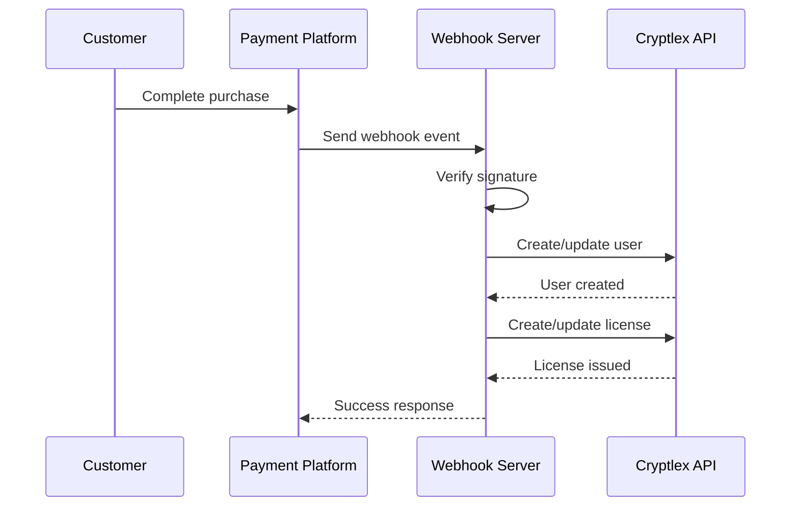

## Architecture

The Cryptlex Payment Platform Integrations use a webhook-based architecture to synchronize payment events with your Cryptlex account. Each integration is a standalone HTTP server built with the Hono framework that listens for webhooks from payment platforms and makes authenticated API calls to Cryptlex.

### How it works



<Steps>
  <Step title="Customer completes payment">
    A customer completes a purchase or subscription payment in your payment platform (Stripe, FastSpring, or Paddle).
  </Step>
  
  <Step title="Webhook event sent">
    The payment platform sends a webhook event to your deployed integration server with details about the transaction.
  </Step>
  
  <Step title="Signature verification">
    The webhook server verifies the cryptographic signature to ensure the request is authentic and hasn't been tampered with.
  </Step>
  
  <Step title="User management">
    The server checks if a Cryptlex user exists with the customer's email. If not, it creates a new user account.
  </Step>
  
  <Step title="License management">
    Based on the event type, the server creates a new license, renews an existing one, or updates the license status (suspend, resume, delete).
  </Step>
  
  <Step title="Success response">
    The server returns a success response to the payment platform, completing the webhook workflow.
  </Step>
</Steps>

## Supported payment platforms

Each integration supports specific webhook events that trigger license operations:

### Stripe

The Stripe integration handles checkout sessions and recurring invoice payments.

**Supported events:**

- `checkout.session.completed` - Creates a user and issues a license when checkout completes
- `invoice.paid` - Renews or creates a license when an invoice is paid
- `customer.created` - Creates a Cryptlex user when a Stripe customer is created

**Environment variables:**

- `STRIPE_WEBHOOK_SECRET` - Webhook signing secret from Stripe
- `CRYPTLEX_PRODUCT_ID` - The Cryptlex product ID for licenses
- `CRYPTLEX_ACCESS_TOKEN` - API token with `license:read`, `license:write`, `user:read`, `user:write` permissions
- `CRYPTLEX_WEB_API_BASE_URL` - Base URL for the Cryptlex API

### FastSpring

The FastSpring integration manages orders and subscription lifecycle events.

**Supported events:**

- `order.completed` - Creates a user and license for completed orders
- `subscription.charge.completed` - Renews a license when a subscription charge succeeds
- `subscription.payment.overdue` - Suspends a license when payment is overdue
- `subscription.deactivated` - Deletes the license when a subscription is deactivated

**Environment variables:**

- `FASTSPRING_WEBHOOK_SECRET` - HMAC secret for webhook verification
- `CRYPTLEX_ACCESS_TOKEN` - API token with `license:read`, `license:write`, `user:read`, `user:write`, and optionally `licenseTemplate:read` for add-on support
- `CRYPTLEX_WEB_API_BASE_URL` - Base URL for the Cryptlex API

### Paddle

The Paddle integration handles transactions and subscription pauses.

**Supported events:**

- `transaction.completed` - Creates or renews a license when a transaction completes
- `subscription.paused` - Suspends a license when a subscription is paused
- `customer.created` - Creates a Cryptlex user when a Paddle customer is created

**Environment variables:**

- `PADDLE_WEBHOOK_SECRET` - Webhook secret for signature verification
- `CRYPTLEX_ACCESS_TOKEN` - API token with `license:read`, `license:write`, `user:read`, `user:write` permissions
- `CRYPTLEX_WEB_API_BASE_URL` - Base URL for the Cryptlex API

<Note>
Paddle webhook verification uses the official Paddle SDK (`paddle.webhooks.unmarshal`), so no Paddle API key is required.
</Note>

## Webhook verification

All integrations verify webhook authenticity before processing events:

**Stripe:** Uses `Stripe.webhooks.constructEventAsync()` to verify the `stripe-signature` header

**FastSpring:** Computes HMAC-SHA256 signature and compares with the `x-fs-signature` header

**Paddle:** Uses the Paddle SDK to unmarshal and verify the `Paddle-Signature` header

If verification fails, the webhook is rejected with a 400 error response.

## Deployment options

The integrations can be deployed to multiple environments:

### AWS Lambda

Deploy serverless functions to AWS Lambda using the provided GitHub Actions workflow. Each integration has a `build:*:aws` script that bundles the code for Lambda deployment.

**Benefits:**
- Serverless, scales automatically
- Pay only for actual webhook processing
- Managed infrastructure

### Docker containers

Use the included `Dockerfile` to containerize the webhook server. The multi-stage build produces a minimal Alpine-based image.

**Build example:**
```bash
docker build --build-arg PAYMENT_PLATFORM=stripe -t cryptlex-stripe .
```

**Benefits:**
- Run anywhere Docker is supported
- Consistent deployment environment
- Easy local development and testing

### Node.js server

Run directly on any Node.js 22+ environment using the `build:*:node` scripts.

**Benefits:**
- Simple deployment to VPS or PaaS
- Full control over the runtime
- Standard Node.js debugging tools

## API client architecture

All integrations use `openapi-fetch` with Cryptlex's OpenAPI types for type-safe API calls:

```typescript
import createClient from 'openapi-fetch';
import { paths } from '@cryptlex/web-api-types/production';

const CtlxClient = createClient<paths>({
  baseUrl: CRYPTLEX_WEB_API_BASE_URL
});

CtlxClient.use(getAuthMiddleware(CRYPTLEX_ACCESS_TOKEN));
```

This approach provides:

- Full TypeScript autocomplete for all Cryptlex API endpoints
- Compile-time validation of request and response types
- Automatic authentication via middleware
- Type-safe error handling

## Error handling

Each integration includes comprehensive error handling:

- Missing environment variables are detected on startup
- Webhook signature verification failures return 400 errors
- Unsupported event types are logged and rejected
- Cryptlex API errors are caught and logged
- All errors include descriptive messages for debugging

<Warning>
Make sure to configure webhook retry settings in your payment platform. If the integration server is temporarily unavailable, the payment platform should retry failed webhooks.
</Warning>

## Next steps

<CardGroup cols={2}>
  <Card title="Quick start" icon="rocket" href="/quickstart">
    Deploy your first integration in minutes
  </Card>
  
  <Card title="Stripe integration" icon="stripe" href="/integrations/stripe">
    Detailed Stripe setup guide
  </Card>
</CardGroup>